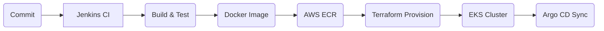

# 🚀 CI/CD Pipeline to Kubernetes on AWS

[] [] [] [] [] []

---

## 📊 Project Snapshot



---

> **An enterprise-grade portfolio project demonstrating a complete DevOps workflow:**  
> Terraform → Jenkins → AWS ECR → EKS → Argo CD

---

## 📑 Table of Contents

1. [Project Overview](#project-overview)
2. [Repository Layout](#repository-layout)
3. [Pipeline Flow](#pipeline-flow)
4. [Best Practices](#best-practices)
5. [Next Steps](#next-steps)

---

## 🧐 Project Overview

This repository demonstrates an enterprise-grade CI/CD workflow:

1. **Infrastructure as Code**  
   - **Terraform** modules define a production VPC (public & private subnets, NAT gateway, routing), an EKS cluster with worker node groups, an ECR registry, and a Jenkins CI server.  
   - Remote state is stored in S3 + DynamoDB with lifecycle and locking policies.  
   - A two-phase “bootstrap” pattern separates IAM role creation from workload provisioning, avoiding circular dependencies and enforcing least-privilege.

2. **Continuous Integration**  
   - **Jenkins** runs in a private Dev VPC. A declarative `Jenkinsfile` checks out code, builds the Node.js app, runs tests, builds a Docker image, and pushes it to ECR.

3. **Continuous Delivery & GitOps**  
   - **Argo CD** in the EKS cluster watches the `k8s/` folder in Git.  
   - Any updates to Kubernetes manifests (Deployment, Service) automatically reconcile the live cluster to your desired state.

4. **Application Best Practices**  
   - Namespace deployment (`production`) with rolling updates.  
   - Resource requests/limits, readiness & liveness probes.  
   - Pod anti-affinity for high availability.  
   - Non-root containers and fine-grained IAM roles for security.

---

## 🗂 Repository Layout

```text
ci-cd-pipeline-to-k8s/
├── app/                   # Node.js service + Dockerfile
├── k8s/                   # Kubernetes Deployment & Service manifests
├── infra/
│   ├── state/             # Terraform state (S3 & DynamoDB)
│   ├── bootstrap/         # IAM role bootstrap for Terraform/Jenkins
│   ├── modules/           # vpc, eks, ecr, jenkins modules
│   ├── backend.hcl        # Remote-state config
│   ├── providers.tf       # AWS provider config (assume-role)
│   ├── main.tf            # Root Terraform orchestration
│   ├── variables.tf       # Root variables
│   ├── locals.tf          # Common tags & naming
│   └── outputs.tf         # Root outputs
├── Jenkinsfile            # Declarative pipeline for CI/CD
└── README.md              # Project documentation (this file)
```

---

## 🚦 Pipeline Flow

1. **Code Commit** triggers **Jenkins**  
2. **Build & Test** Node.js, then **Docker Build**  
3. **Push** to **AWS ECR**  
4. **Terraform Plan & Apply** provisions VPC, EKS, ECR, Jenkins  
5. **Argo CD** watches `k8s/` and reconciles the cluster

---

## 🔒 Best Practices

- **Two-Phase Bootstrap**: Separate IAM provisioning from workload modules  
- **Secure Remote State**: S3 bucket with versioning & SSE, DynamoDB locking  
- **Least-Privilege IAM**: Fine-grained roles for Terraform, EKS, EC2  
- **Resilient Kubernetes**: Rolling updates, readiness & liveness probes, pod anti-affinity  
- **Resource Governance**: CPU/memory requests & limits, non-root containers

---

## 🎯 Next Steps

- [ ] Deploy **Argo CD** inside EKS for full GitOps  
- [ ] Add **Horizontal Pod Autoscaler**  
- [ ] Front Jenkins with **ALB & IAM authentication**  
- [ ] Integrate **automated tests** in Jenkins  
- [ ] Implement **monitoring & alerts** (Prometheus, Grafana)

---

## ⚠️ Work in Progress

This project is under active development—expect additional enhancements soon.

> *Crafted by Shalev Bohadana as a portfolio project demonstrating enterprise-grade DevOps practices.*
